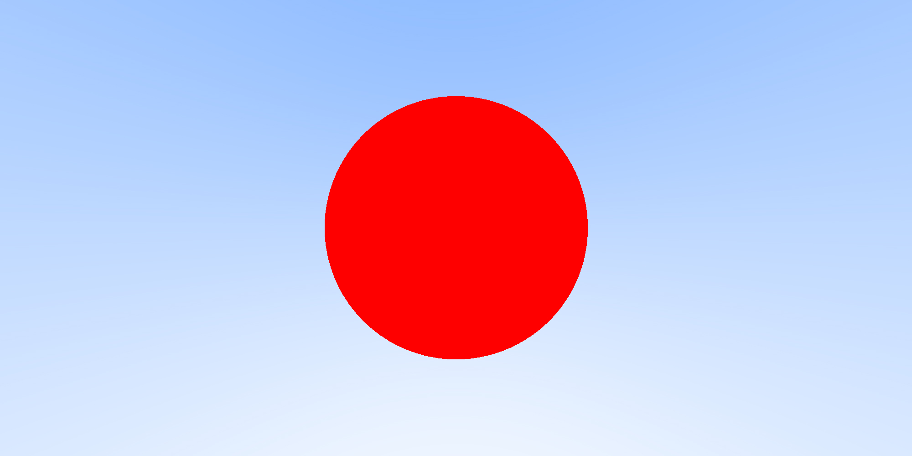
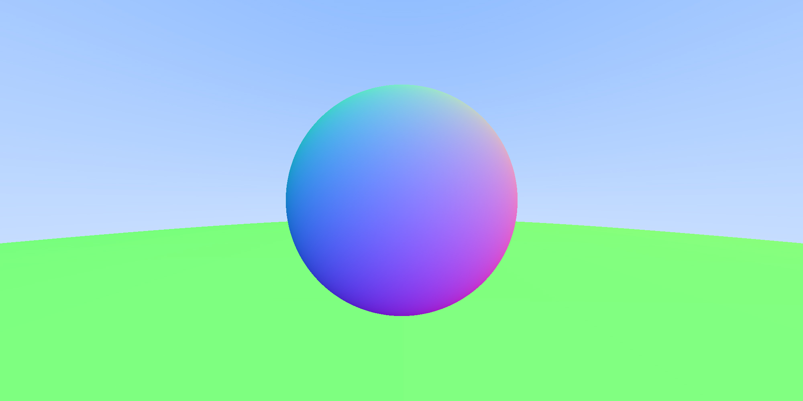
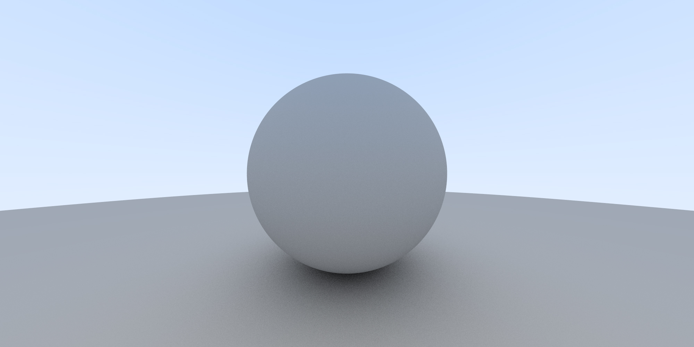

# CUDA Ray Tracing

Result of each chapter in the ebook `"Ray Tracing in One Weekend"` by `Peter Shirley`.

## Simple Gradient Image

## Gradient Background

## Simple Sphere

## Spheres with Normal Map

## Anti-Aliasing

<!-- **Without Anti-Aliasing** | **With Anti-Aliasing**
--- | --- -->

  

    <strong>Without Anti-Aliasing</strong> 
    
  

  

    <strong>With Anti-Aliasing</strong> 
    
  

## Diffuse Material

# Debugging Tools

* **compute-sanitizer** [path/to/cuda_executable]
* **cuda-gdb** [path/to/cuda_executable] + run [args]
* [**demangler**](http://demangler.com/) - just put GCC symbol name and get demangled name
